# Bitochi Games

> **16 original games for Garmin smartwatches** — built with Monkey C / Connect IQ SDK.  
> Optimized for round screens, accelerometer input, and short play sessions.

---

## Portfolio

### 🎱 8 Ball
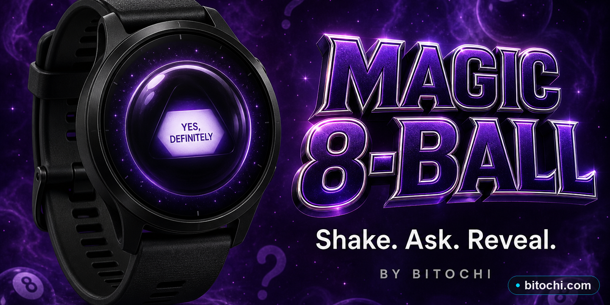
**Folder:** `8ball/` | **Type:** Arcade / Skill  
Pocket billiards on your wrist. Aim with the accelerometer, choose your shot, and pocket the balls in order. Magic 8-Ball answers included for fun.

---

### 🕹️ Arcade
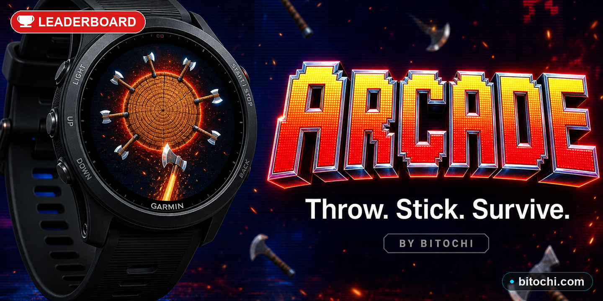
**Folder:** `arcade/` | **Type:** Arcade / Collection  
Axe-throwing arcade — spin a log, stick axes without collision. Classic reflex game with progressive difficulty and speed levels.

---

### 🟢 Blobs
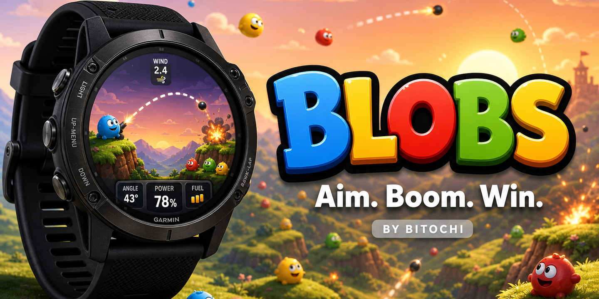
**Folder:** `blobs/` | **Type:** Strategy / Battle  
Tactical blob warfare. Choose angle and power with the accelerometer, launch weapons (bullets, grenades, nukes) at enemy blobs across destructible terrain. Supports **1-player vs AI** and **2-player local** mode. 3 weapon types with limited specials per level.

---

### 🟦 Blocks
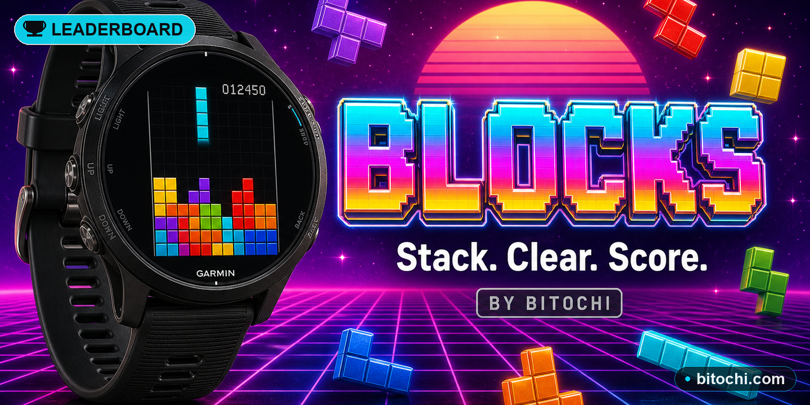
**Folder:** `blocks/` | **Type:** Puzzle / Tetris  
Fluid Tetris-style puzzle optimized for Garmin. Accelerometer controls left/right, buttons rotate and drop. Features **5 power-ups** (Bomb, Laser, Freeze, Smash, Color Clear), ghost piece preview, screen shake on line clear, and combo scoring.

---

### 💣 Bomb
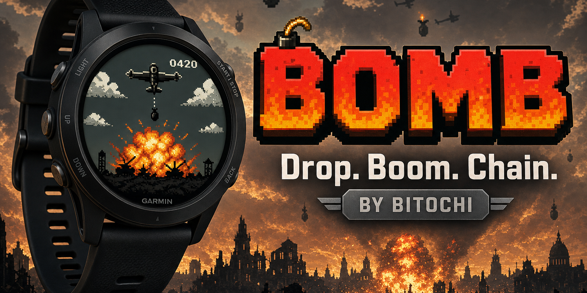
**Folder:** `bomb/` | **Type:** Arcade / Action  
Steer a plane and drop bombs on ground targets. Chain explosions for combo multipliers. Progressive enemy density with each level.

---

### 🥊 Boxing
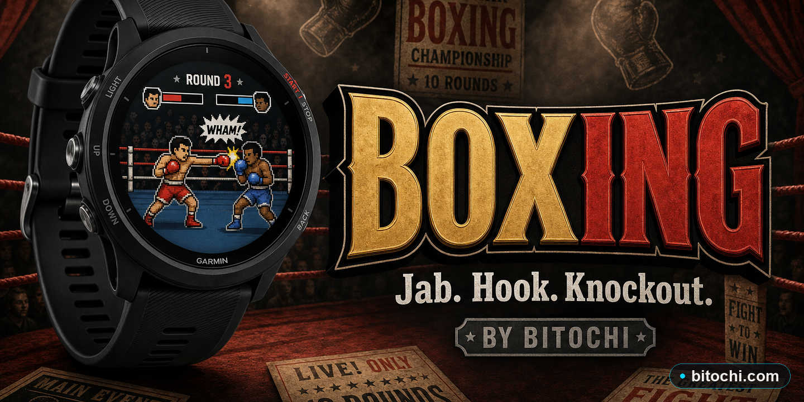
**Folder:** `boxing/` | **Type:** Sports / Fighting  
Micro fight club on your watch. Time your punches, blocks, and dodges against increasingly tough opponents. Quick tap combat with accelerometer dodge mechanics.

---

### 🧱 Bricks
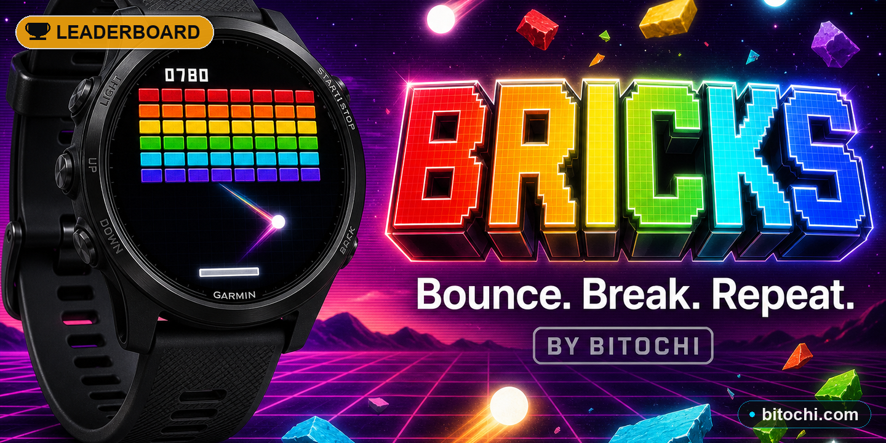
**Folder:** `bricks/` | **Type:** Arcade / Breakout  
Classic brick breaker — accelerometer controls the paddle. Bricks gain HP at higher levels and drop power-ups (multi-ball, laser, wide paddle, fireball). Smooth physics with wall/brick/paddle collisions.

---

### ⚔️ Catapult
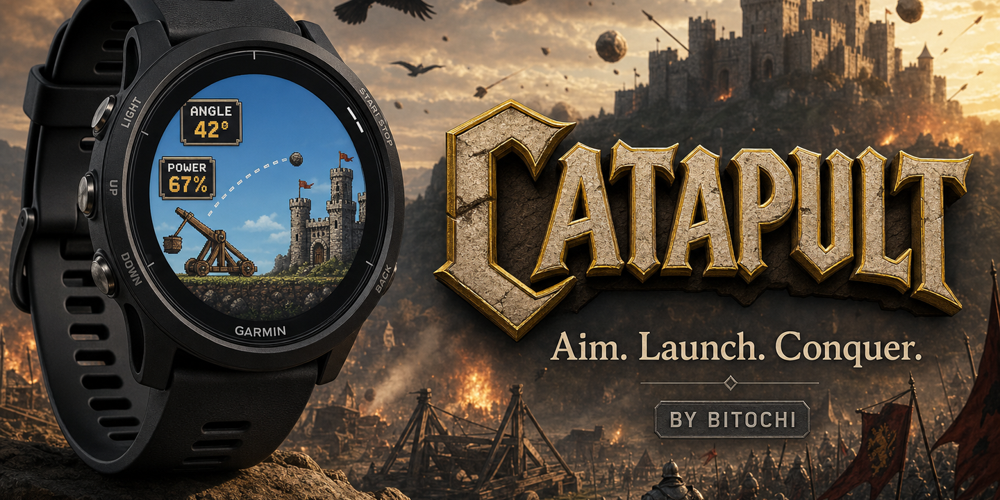
**Folder:** `catapult/` | **Type:** Strategy / Siege  
Medieval siege game — 16 fairy-tale rounds of castle destruction. Aim angle then power in two steps. 4 weapon types (Standard, Triple, Mega, Nuke) with unique explosion effects. In-round shop for upgrades.

---

### 🌌 Star Colony
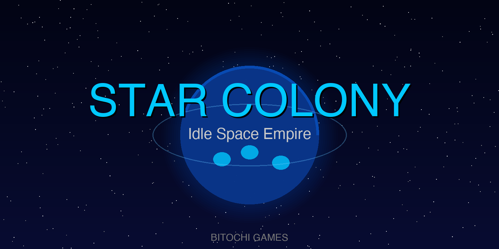
**Folder:** `colony/` | **Type:** Idle / Clicker  
Build and upgrade a space colony empire that generates resources passively. **4 buildings** (Mining Drones, Energy Reactor, Bio Farm, Research Lab), offline earnings, x2 production boost, prestige system, and random resource events. Saves state between sessions.

---

### 💎 Color Pop
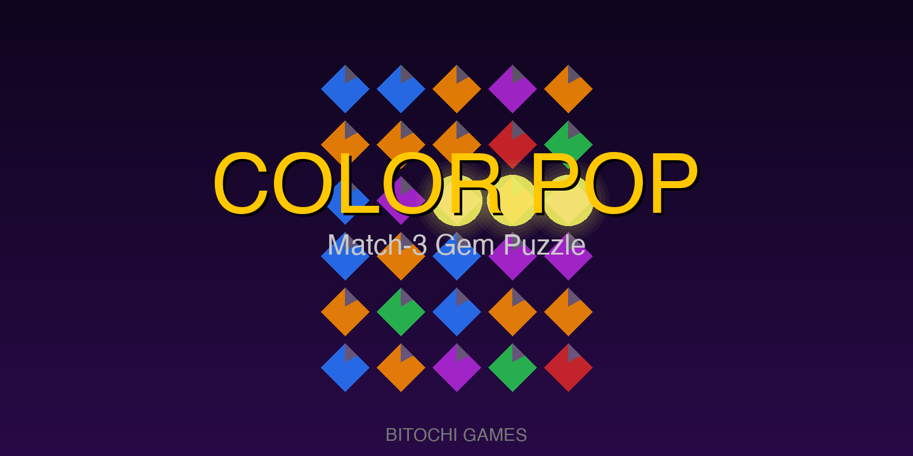
**Folder:** `color/` | **Type:** Puzzle / Match-3  
Match-3 gem puzzle on a 5×6 grid. Swap adjacent gems to create chains. **4 power gem types** — BOMB (3×3 clear), STAR (clear all of one color), CROSS (row+col wipe), RAINBOW (wildcard). Combo multipliers, level progression with increasing difficulty, score targets per level.

---

### 🐟 Fish
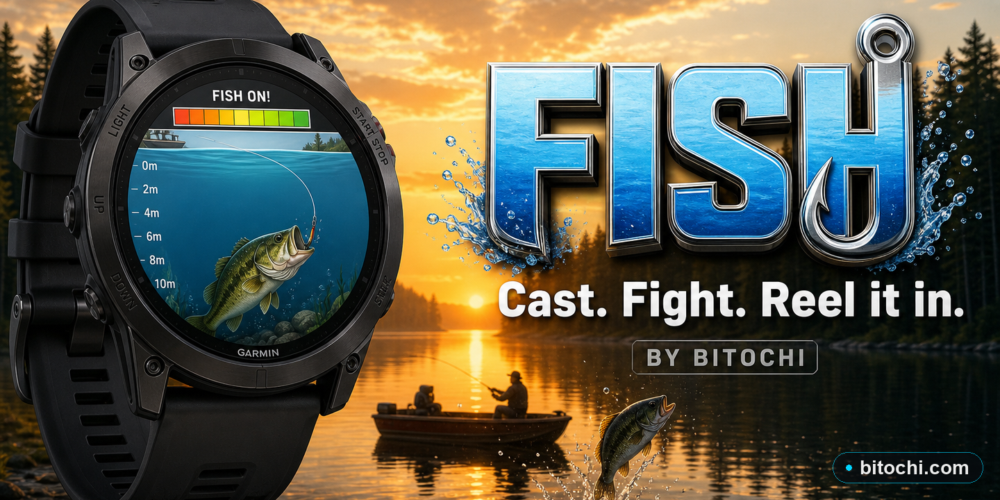
**Folder:** `fish/` | **Type:** Sport / Simulation  
Deep water fishing simulation. Cast to your target fish, then fight it with accelerometer tension control — keep the bar in the green zone or the line snaps. **10 unique fish species** with realistic weights and personalities. Level progression unlocks rarer fish. 3 lives per round.

---

### 🪂 Parachute
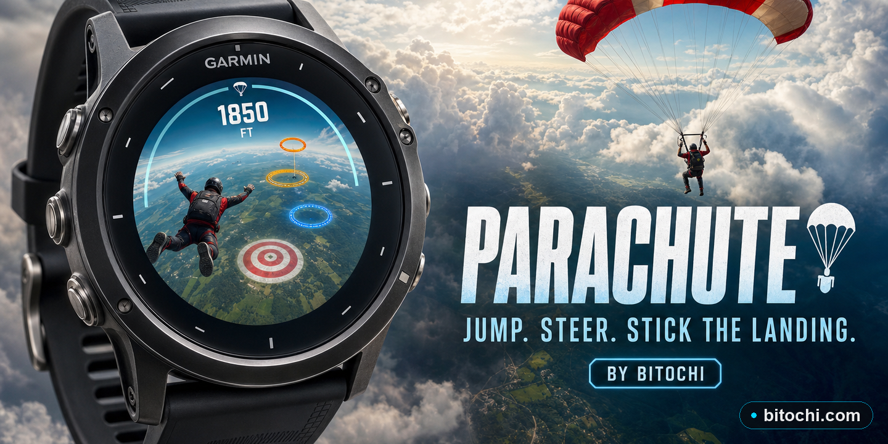
**Folder:** `parachute/` | **Type:** Arcade / Skill  
Freefall from altitude and land precisely on the target. Tilt accelerometer to steer, tap to open canopy (only below 300m). Collect rings on the way down. Progressive levels require collecting more rings to pass.

---

### 🐾 Pets
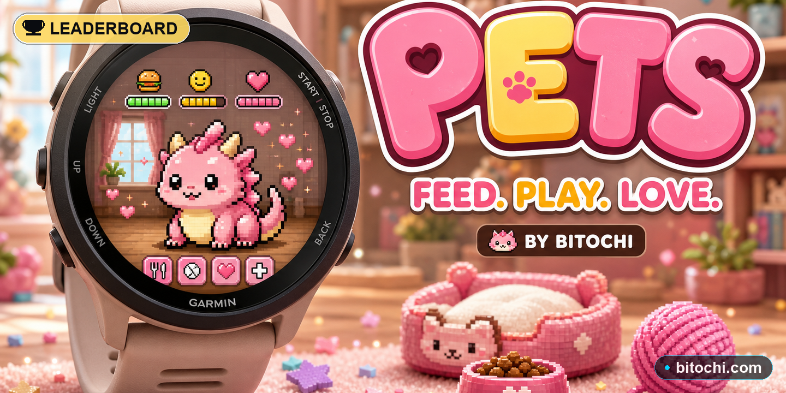
**Folder:** `pets/` | **Type:** Virtual Pet / Simulation  
Virtual pet companion for your watch. Feed, play with, and care for your pixel creature. Mood, hunger, and energy stats. Mini-games to earn food and toys. Pet evolves over time.

---

### 🏃 Run
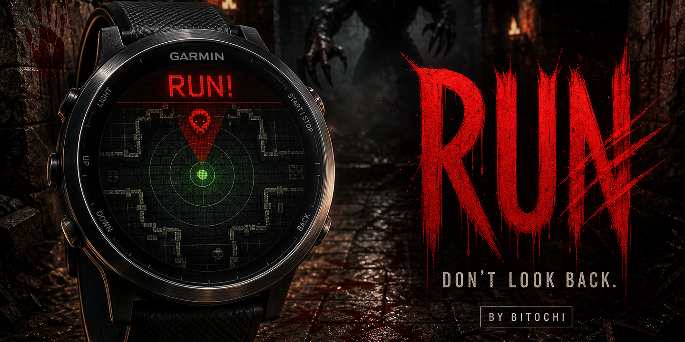
**Folder:** `run/` | **Type:** Endless Runner  
Monster escape — scan dungeons, find creatures, then run for your life. Accelerometer-based lane switching and obstacle dodging. Progressive speed and enemy density.

---

### 🐍 Serpent
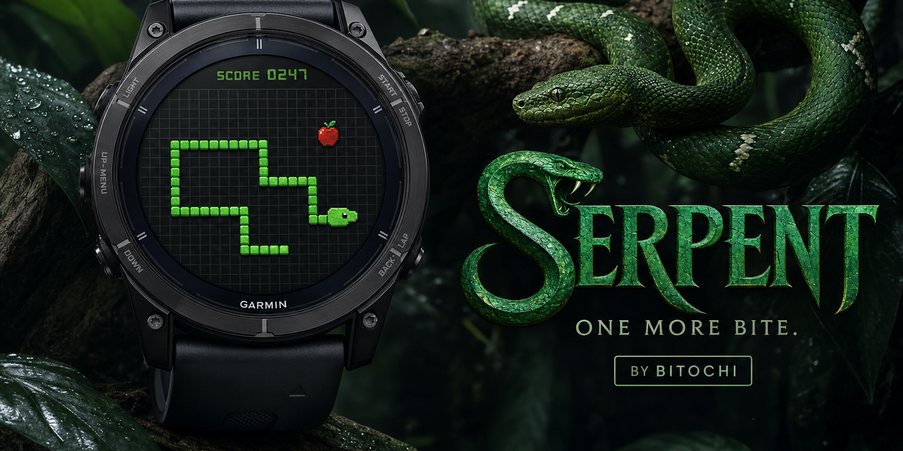
**Folder:** `serpent/` | **Type:** Arcade / Snake  
Neon snake with a twist. Accelerometer or button turning. **5 power-ups** (Speed, Shrink, Ghost walls, Shield, Score Multiplier) and **4 chaos events** (Reverse controls, Portal teleport, Food Rain, Magnet). Gradient snake body, particle effects, combo scoring.

---

### 🎿 Ski Jump
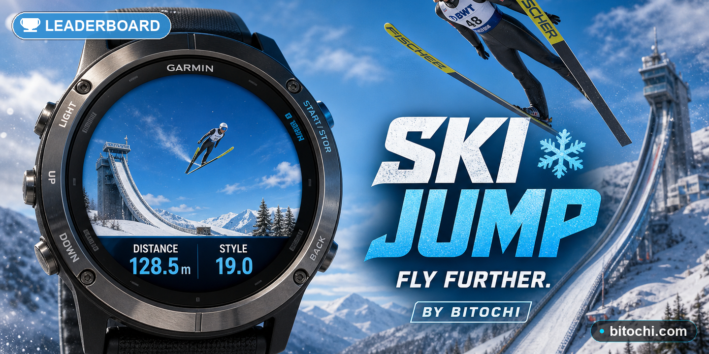
**Folder:** `skijump/` | **Type:** Sports / Simulation  
4-hill ski jumping tournament. Tap to launch off the ramp, balance with the accelerometer in flight to maximize distance, tap again to land (telemark / two-foot / crash depending on timing and angle). AI competitors, per-venue records, wind simulation, style points. The deeper the jump, the higher the rank.

---

## Supported Devices

**160 Garmin watch models**, including:

| Series | Models |
|--------|--------|
| **Fenix 3–8** | fenix3, fenix5/5S/5X, fenix6/Pro, fenix7/7S/7X/Pro, fenix8 43/47mm, Solar |
| **Descent** | Mk1, Mk2, Mk2s, G1, G2, Mk3 43mm, Mk3 51mm |
| **Forerunner** | fr55, fr265/s, fr570/745/745, fr945/lte, fr955, fr965, fr970 |
| **Venu** | venu, venu2/2s/2plus, venu3/3s, venu441/445, venusq/sq2, venud, venux1 |
| **Vivoactive** | vivoactive3/4/4s/5/6 |
| **Instinct** | instinct2/2s/2x, instinct3 amoled/solar, instinct e/crossover |
| **Epix** | epix, epix2, epix2pro 42/47/51mm |
| **MARQ** | marq2, marq2aviator, marqathlete, marqcaptain, marqcommander, marqdriver... |
| **D2 Aviation** | d2air, d2airx10, d2mach1, d2mach2, d2charlie, d2delta/px/s |
| **Edge / GPS** | edge530–1050, gpsmap66/67/86/h1 |
| **Approach** | approachs50/60/62/7042mm/7047mm |
| **Enduro** | enduro, enduro3 |
| **Legacy** | legacysagarey, legacyhero series |

---

## Build

```bash
SDK="/path/to/connectiq-sdk/bin"
KEY="/path/to/developer_key.der"

# Single game — dev build (fenix7)
$SDK/monkeyc -d fenix7 -f <game>/monkey.jungle -o _PROD/<game>.prg -y $KEY

# Store package (all devices)
$SDK/monkeyc -f <game>/monkey.jungle -o _STORE/<game>.iq -y $KEY --package-app
```

### Build all games
```bash
for game in 8ball arcade blobs blocks bomb boxing bricks catapult color fish parachute pets run serpent skijump; do
  $SDK/monkeyc -d fenix7 -f $game/monkey.jungle -o _PROD/$game.prg -y $KEY
  $SDK/monkeyc -f $game/monkey.jungle -o _STORE/$game.iq -y $KEY --package-app
done
```

---

## Project Structure

```
garmin/
├── _PROD/          # .prg dev builds (fenix7)
├── _STORE/         # .iq store packages (all devices)
├── _LOGOS/         # Hero images 1440×720 for Connect IQ store
├── 8ball/
├── arcade/
├── blobs/
├── blocks/
├── bomb/
├── boxing/
├── bricks/
├── catapult/
├── colony/
├── color/
├── fish/
├── parachute/
├── pets/
├── run/
├── serpent/
└── skijump/
```

Each game folder contains:
```
<game>/
├── manifest.xml       # App ID, device list, permissions
├── monkey.jungle      # Build config
├── source/            # Monkey C source files
└── resources/         # Strings, drawables, launcher icon
```

---

## Tech Stack

- **Language:** Monkey C (Garmin Connect IQ SDK 4.0+)
- **Input:** Accelerometer, buttons (SELECT / MENU / UP / DOWN / BACK)
- **Storage:** `Toybox.Application.Storage` for persistent scores/state
- **Vibration:** `Toybox.Attention` for haptic feedback
- **Timer:** 70–120ms game loops via `Toybox.Timer`
- **Graphics:** `Toybox.Graphics.Dc` — primitives only, no sprite assets

---

*Private project — Bitochi Games*
