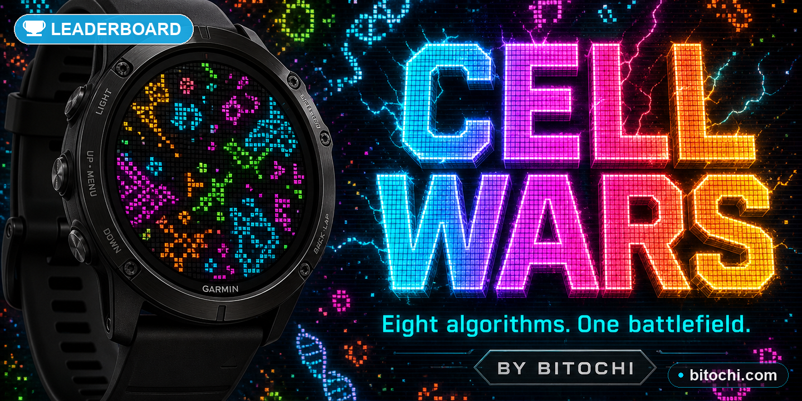

# Bitochi Cell Wars

Cellular automata battle simulator for Garmin round watches (Connect IQ).

Watch armies of living cells fight for territory using eight different evolutionary
algorithms — or just sit back and let a single ruleset evolve in silence.



---

## Modes

| Mode | Description |
|------|-------------|
| **BATTLE** | 2–4 teams all use Conway rules. When an empty cell is born, the dominant neighbour colour claims it. |
| **RUMBLE** | 2–4 teams each get a randomly assigned algorithm. Different birth/survival rules create asymmetric warfare. |
| **CONWAY** | Classic Game of Life — B3/S23. |
| **HIGHLIFE** | B36/S23 — same as Conway but cells can also be born with 6 neighbours, producing self-replicating gliders. |
| **DAY+NIGHT** | B3678/S34678 — symmetric ruleset; dead and alive regions behave identically. |
| **MAZE** | B3/S12345 — cells survive almost anything, growing into intricate maze-like corridors. |
| **SEEDS** | B2/S— — every living cell dies next generation; explosive, ephemeral bursts. |

## Algorithms (available in RUMBLE)

| Tag | Rule | Character |
|-----|------|-----------|
| CONWAY | B3/S23 | balanced growth |
| HLIFE | B36/S23 | glider-heavy |
| D+N | B3678/S34678 | mirror-symmetric |
| MAZE | B3/S12345 | labyrinthine |
| SEEDS | B2/S— | burst/scatter |
| CORAL | B3/S45678 | slow, dense accretion |
| REPLI | B1357/S1357 | fractal self-replication |
| AMOEBA | B357/S1358 | blob-like expansion |

## Controls

| Input | In simulation | In menu |
|-------|---------------|---------|
| **SELECT / tap** | Open menu | Confirm / cycle option |
| **UP** | Speed up | Move cursor up |
| **DOWN** | Speed down | Move cursor down |
| **BACK** | — | Return to simulation (if running) |

## Settings

All settings are adjusted from the in-app menu:

- **MODE** — simulation mode (cycles through all 7)
- **TEAMS** — 2, 3 or 4 (only active in BATTLE / RUMBLE)
- **SPEED** — 1–5 (controls how many grid rows are computed per 80 ms tick)
- **FILL** — initial cell density: LOW (28 %), MED (44 %), HIGH (64 %)
- **THEME** — colour palette: NEON / OCEAN / FIRE / FOREST
- **RESET** — randomise the grid and start a new run immediately
- **START** — launch with the current settings (randomises on first run)

## HUD (during simulation)

- **Top centre** — current mode name + generation counter
- **Bottom bar** — proportional territory bar per team (BATTLE / RUMBLE only)
- **Team labels** — percentage share; RUMBLE also shows each team's algorithm tag
- **VICTORY flash** — appears briefly when one team exceeds 96 % of all living cells,
  then the grid auto-resets

## Auto-reset

The simulation detects stagnation every 6 generations and re-randomises automatically:

- fewer than 5 alive cells — resets after 8 consecutive stale checks
- population frozen at exactly the same count — resets after 30 checks

This keeps the watch interesting indefinitely without any user interaction.

## Technical notes

- **Grid**: 28 × 28 = 784 cells, each stored as a single byte (0 = dead, 1–4 = team index).
- **Row-batch processing**: to stay within Garmin's ~200 ms watchdog budget, only N rows
  are computed per 80 ms timer tick (N = 2 / 4 / 7 / 10 / 14 depending on speed setting).
  The displayed grid always shows a complete generation; the next generation accumulates
  in a back-buffer and is swapped in atomically when all rows are done.
- **Neighbour loop unrolling**: all 8 neighbour reads are inlined to avoid loop overhead
  inside the hot inner loop.
- **No external sensors or permissions required.**

## Build

```bash
monkeyc -o _PROD/cellwars.prg \
        -f cellwars/monkey.jungle \
        -y developer_key.der \
        -d fenix8solar51mm
```

Or use the root `_build_all.sh` which includes `cellwars` in the `APPS` array.
