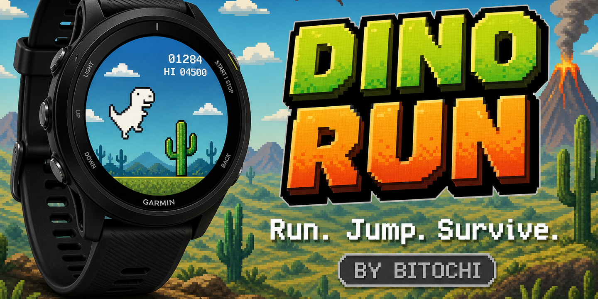

# Bitochi Dino Run

Chrome-style endless T-Rex runner for Garmin round watches (Connect IQ).

Press any button, survive as long as possible, unlock new abilities as your score grows.



---

## Gameplay

A chubby dinosaur sprints from left to right. Obstacles scroll in from the right — cacti on the ground and, in later stages, flapping pterodactyls in mid-air. Jump over them, duck under them, or use a double-jump when timing gets tight. The game never ends; it just gets faster.

---

## Phases / progression

| Score | Phase | What unlocks |
|-------|-------|--------------|
| 0 | **Phase 1** — Slow start | Single jump, ground cacti only, speed 5 px/tick |
| 300 | **Phase 2** — Double Jump | `x2 JUMP!` flash; second mid-air jump available |
| 1500 | **Phase 3** — Duck & Fly | `DUCK!` flash; DOWN button crouches; pterodactyls appear (35 % of spawns) |

Speed ramps continuously from **5** to **16 px/tick** and the score number shifts from grey to red as you approach the limit.

---

## Coins & combo

Golden coins float in from the right on their own independent spawn timer
(never placed on top of an active obstacle), at one of two jump-reachable
heights. Grab one for a points bonus that **grows with your combo**:

| Combo | Bonus per coin |
|-------|-----------------|
| 1st coin | +20 |
| 2nd coin in a row | +25 |
| 3rd coin in a row | +30 |
| ... capped at | +60 (9th+ in a row) |

Letting a coin scroll off-screen uncollected breaks the combo back to zero —
so once you're on a streak, every coin becomes a small risk/reward decision.
A `COMBO x N` counter appears above the HUD once you hit 2 in a row, growing
brighter (amber → orange) the higher it climbs, and every 3rd consecutive
coin triggers a bright gold border flash across the whole screen.

---

## Day / Sunset / Night / Dawn

The backdrop now cycles through **four** stages instead of two, roughly every
15 seconds of play, so a long run keeps looking fresh:

| Stage | Sky | Background |
|-------|-----|------------|
| Day | neutral dark | grey clouds |
| Sunset | warm brown-orange | orange-tinted clouds + a low sun disc, horizon glow |
| Night | cool dark blue | twinkling stars |
| Dawn | violet | twinkling stars (violet tint), horizon glow |

---

## Controls

| Input | Action |
|-------|--------|
| **UP / SELECT / tap** | Jump (or double-jump in phase 2+) |
| **DOWN** | Duck / crouch (phase 3+) · ground-pound while airborne |
| **BACK** | End current run |
| Any key on title / game-over | Start / restart |

### Double jump
A second `UP` press while airborne fires a weaker second jump (velocity –11 vs –17 for first jump). A burst of yellow sparkles confirms the activation. Resets on landing.

### Ducking
`DOWN` on the ground compresses the dino to 55 % of its full height for ~1.4 seconds. Pterodactyls fly at ~60 % of dino height above the ground — a crouching dino passes safely underneath with a few pixels of clearance. Pressing `DOWN` while airborne triggers a **ground-pound** (instant fast fall).

---

## Obstacles

| Type | Appears from | How to avoid |
|------|-------------|--------------|
| Small cactus | Phase 1 | Jump early |
| Medium cactus | Phase 1 | Jump early |
| Large cactus | Phase 1 | Jump with good timing |
| Pterodactyl | Phase 3 | Duck under it **or** jump over it at peak height |

---

## Visual polish

- **Landing dust puff** — a small burst of dust appears at the dino's feet
  every time it lands from a jump.
- **Coin sparkle** — a golden burst + floating "+N" plays on every collect.
- **Combo flash** — a bright pulsing gold border on every 3rd consecutive
  coin, for an unmissable payoff.

---

## Dino expressions

The dinosaur reacts to what's happening:

- **Running** — big round eyes, legs alternate
- **Jumping** — surprised O-mouth, pupil looks upward, bigger eye
- **Ducking** — squinting eyes, angry brow, flat determined mouth
- **Near obstacle** — blue sweat drop appears on forehead
- **Dead** — X-eyes, tongue sticking out, turns red

The tiny arms are exactly as functional as a real T-Rex's.

---

## Scoring

Score increments by 1 each game tick (≈30/sec), plus the near-miss and coin
bonuses described above. Reaching **00300** and **01500** triggers phase
unlocks. High score persists until the app is closed.

The score display shifts colour as speed increases:

| Speed | Score colour |
|-------|-------------|
| 5 px/tick | dark grey |
| 10 px/tick | orange-brown |
| 16 px/tick | red |

---

## Leaderboard

Besides the main survival score, total coins collected and the best combo
reached during the run are mirrored to `coins` and `combo` leaderboard
variants, viewable on the web leaderboard's variant chips for "dinosaur".

## Technical notes

- **Timer**: 33 ms tick (≈30 fps); all physics runs every tick.
- **Jump physics**: velocity –17, gravity +2/tick → ~64 px peak height. Double-jump adds –11 (≈36 px more from peak).
- **Crouching hitbox**: effective height shrinks to 55 % of full; pterodactyl bottom sits at 60 % above ground → 5 % clearance gap.
- **Ground-pound**: sets `vy = 12` immediately, snapping the dino to ground.
- **Spawn gap**: starts at 72 ticks, shrinks by 4 per extra speed unit, minimum 28 ticks; phase 3 subtracts another 8.
- **Pterodactyl wings**: animated using `fillPolygon` triangles, flap every 6 frames.
- **No external sensors or permissions required.**

## Build

```bash
monkeyc -o _PROD/dinosaur.prg \
        -f dinosaur/monkey.jungle \
        -y developer_key.der \
        -d fenix8solar51mm
```

Or use the root `_build_all.sh` which includes `dinosaur` in the `APPS` array.
