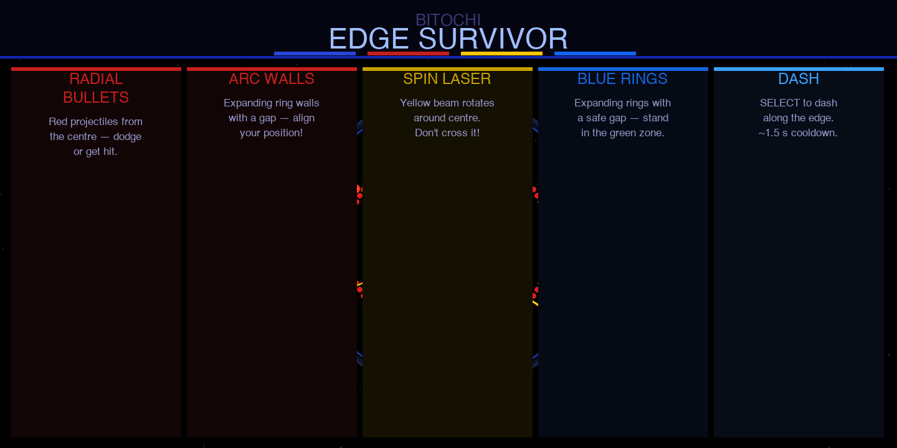

# Bitochi Edge Survivor

A minimalist circular survival game designed specifically for **round Garmin watches**.

You are locked to the **edge of the screen**. Everything spawns from the centre and races toward you.



---

## Concept

The player's position is defined entirely by a single **angle** (0–359 °) on a fixed circle. There is no jumping, no grid — just smooth angular movement and one lifesaving dash.

Four classes of hazard originate from the centre and advance outward:

| Enemy | Colour | Mechanic |
|-------|--------|----------|
| Radial Bullet | Red | Fixed angle, moves outward at constant speed |
| Arc Wall | Red | Expanding arc ring with a **gap** — align with the gap or die |
| Spinning Laser | Yellow | Line rotating around centre — don't cross it |
| Expanding Ring | Blue | Full expanding ring with a **safe gap** (dark green zone) |

---

## Controls

| Button | Action |
|--------|--------|
| UP (hold) | Rotate clockwise |
| DOWN (hold) | Rotate counter-clockwise |
| SELECT / tap | **Dash** — instant 34° jump in current direction (1.5 s cooldown) |
| BACK | End current run |
| Any key | Start / restart |

Swipe gestures (UP/DOWN) inject a 16-tick rotation impulse for watches without long-press physical buttons.

---

## Scoring

- **+1 per game tick** (~30/sec)
- **+15 near-miss bonus** when a bullet passes within 24° without killing you
- High score persists during the session

---

## Difficulty Phases

| Phase | Score threshold | Enemy mix |
|-------|----------------|-----------|
| 0 | 0–199 | Bullets only |
| 1 | 200–599 | + Arc walls + Lasers |
| 2 | 600–1199 | + Rings, faster speed |
| 3 | 1200+ | All types, fastest speed, smallest gaps |

A **"PHASE N!"** notification flashes when a new phase unlocks.

---

## Visual Design

- Pure black background
- Faint concentric depth-guide rings at 25 %, 50 %, 75 % of edge radius
- Player: white dot with blue core + short blue trail
- **Dash ready**: cyan indicator dot just inside the edge
- Death: 8-particle burst + white strobe flash + haptic pulse

---

## Technical Notes

### Sin/Cos Lookup Table

All polar-to-screen conversions use a **pre-computed 360-entry LUT** built once in `onLayout()`:

```
_sinTab[i] = (sin(i° in radians) × 1000) as integer
_cosTab[i] = (cos(i° in radians) × 1000) as integer
```

Screen coordinates:
```
x = cx + cosTab[angle] * radius / 1000
y = cy + sinTab[angle] * radius / 1000
```

Zero `Math.sin` / `Math.cos` calls during the 30 FPS game loop.

### Angle Arithmetic

All angles are **integers (0–359 °)**. Angular velocity uses integer degrees/tick with linear friction (`vel` decrements to 0 when no key held). Maximum speed: ±5 °/tick.

### Enemy Pool

Fixed 8-slot pre-allocated pool — no heap allocation in the game loop. Fields stored as flat integer arrays (`_type`, `_angle`, `_radius`, `_speed`, `_extra`, `_alive`). Enemy behaviour dispatched via `if / else if` on `_type`.

### Arc Wall / Ring Rendering

Both are rendered with dots at every **5°** around their current radius. The safe gap is drawn in dark green; the dangerous arc in red or blue. This avoids the need for `drawArc` and its angle-convention complexities.

### Collision Detection

Player is always at `(playerAngle, edgeRadius)`. Each enemy type uses a different test:

- **Bullet**: `|radius − edgeRadius| < threshold AND angleDiff < 12°`
- **Arc Wall / Ring**: `|radius − edgeRadius| < threshold AND angleDiff > gapHalf` (outside gap = hit)
- **Laser**: `angleDiff < 9°` (always active — the line is continuous)

---

## File Structure

```
edgesurvivor/
├── source/
│   ├── EdgeSurvivorApp.mc   — AppBase entry point
│   ├── GameDelegate.mc      — input routing (held-key + swipe impulse)
│   ├── Player.mc            — angle, velocity, dash, trail
│   ├── EnemyPool.mc         — pre-allocated enemy pool, update, collision
│   ├── SpawnManager.mc      — phase-based spawning
│   └── GameView.mc          — LUT, game loop, all rendering
├── resources/
│   ├── strings.xml
│   ├── drawables.xml
│   └── launcher_icon.png
├── manifest.xml
└── monkey.jungle
```

---

## Build

```bash
# From repo root:
bash _build_all.sh edgesurvivor both
# → _PROD/edgesurvivor.prg   (simulator / sideload)
# → _STORE/edgesurvivor.iq   (Connect IQ Store)
```
