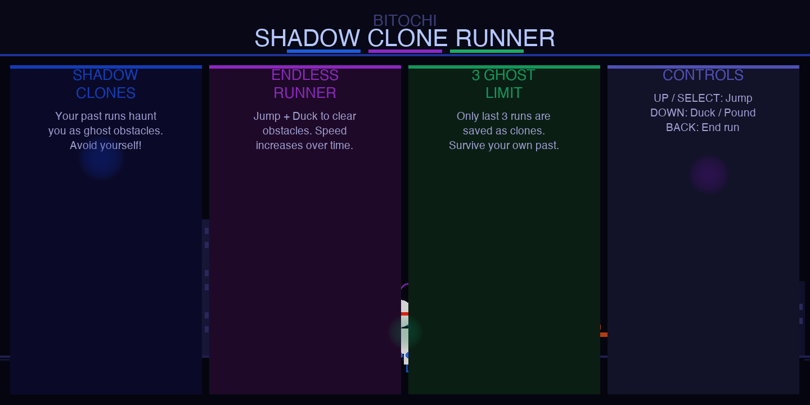

# Bitochi Shadow Clone Runner

An endless runner for Garmin round-face watches with a unique twist: **your past runs come back to haunt you as shadow clones.**



---

## Gameplay

You control a small ninja-like runner jumping and ducking over obstacles.
On every subsequent run, a **ghost clone** of your previous run replays at the same position on screen — and you must avoid it just as you would avoid any obstacle.

After three runs you will have three coloured clones chasing you simultaneously, each replaying a different past run:

| Clone | Colour  | Which run       |
|-------|---------|-----------------|
| 1     | Blue    | Most recent     |
| 2     | Purple  | Second most recent |
| 3     | Green   | Third most recent  |

Older runs are discarded — only the **last 3 runs** are kept.

---

## The Shadow Clone Mechanic

Every tick the game records:
- Player Y position
- Player state (running / jumping / ducking)

On game-over the recording is saved into a circular buffer (max 3 slots).
From the next run onwards, each stored clone **replays its Y position in sync with the current tick**, rendering as a coloured outline ghost.

**Collision with a clone = game over**, just like hitting an obstacle.

A **80-tick grace window** at the start of each run prevents instant death while you react to the clone's first moves.

When a new clone is added, **"NEW CLONE!"** flashes on screen.

---

## Controls

| Button         | Action            |
|----------------|-------------------|
| UP / SELECT    | Jump              |
| DOWN           | Duck (auto-expire 40 ticks) |
| DOWN (airborne)| Ground-pound (fast fall) |
| BACK           | End current run   |
| Any key        | Start / restart   |

---

## Progression

Speed starts at **5 px/tick** and increases as:

```
speed = 5 + score / 250   (max 14 px/tick)
```

Obstacle spawn intervals shrink as speed grows, down to a minimum gap of 28 ticks.

---

## Obstacles

Three sizes are randomly spawned (small / medium / large).
Larger obstacles gain side spines.
Obstacle colour: dark orange-red — clearly distinct from clone outlines.

---

## Visual Style

- Near-black background (`#050510`)
- Dim city skyline silhouettes in background
- Scrolling ground texture
- **Player**: white filled ninja with red headband and animated legs
- **Clones**: coloured outlines only (ghost effect without alpha blending)
- **Jump particles**: blue dust sparks beneath the player on leap
- **Collision flash**: white strobe effect on death

---

## Technical Notes

### Shadow Recording (pre-allocated arrays)
All recording storage is **pre-allocated at initialise-time** to avoid GC pressure:

```
_runY     = new [MAX_RUNS * MAX_FRAMES]   // 3 × 800 = 2 400 elements
_runState = new [MAX_RUNS * MAX_FRAMES]
_recY     = new [MAX_FRAMES]              // current run
_recState = new [MAX_FRAMES]
```

`MAX_FRAMES = 800` caps recording at ~26 seconds per run (~25 KB total shadow data).

### Circular Buffer
Runs are stored in a circular buffer indexed by `_newest`.
Run `runIdx = 0` always refers to the most recently saved clone:

```
slot = (_newest - runIdx + MAX_RUNS) % MAX_RUNS
```

### Clone Collision
The clone hitbox at frame `F` mirrors the player hitbox using the **recorded Y position** and effective height derived from the recorded state (full height when running/jumping, 55 % when ducking).

Collision is only checked after `CLONE_GRACE = 80` ticks to give the player a reaction window.

### Performance
- All draw operations use simple geometric primitives (`fillCircle`, `fillRoundedRectangle`, `drawCircle`, `drawRoundedRectangle`)
- No allocations inside the game loop (all arrays pre-allocated in `initialize()`)
- `_step()` processes: physics → obstacles → recording → obstacle collision → clone collision → score

---

## File Structure

```
shadowclonerunner/
├── source/
│   ├── ShadowCloneRunnerApp.mc   — AppBase entry point
│   ├── GameDelegate.mc            — input routing
│   ├── GameView.mc                — main view, game loop, rendering
│   ├── Player.mc                  — physics & hitbox
│   ├── ObstacleManager.mc         — spawning, movement, collision
│   └── ShadowManager.mc           — recording & clone replay
├── resources/
│   ├── strings.xml
│   ├── drawables.xml
│   └── launcher_icon.png
├── manifest.xml
└── monkey.jungle
```

---

## Build

```bash
# From repo root:
bash _build_all.sh shadowclonerunner both
# → _PROD/shadowclonerunner.prg   (simulator / sideload)
# → _STORE/shadowclonerunner.iq   (Connect IQ Store)
```
